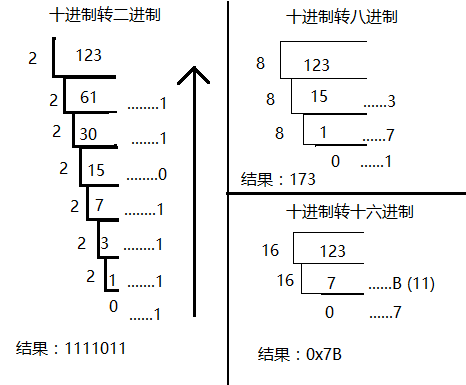
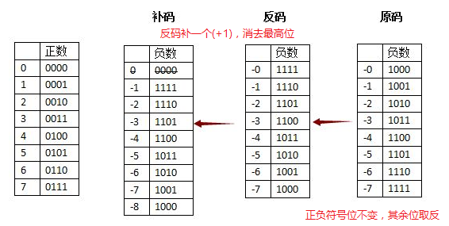
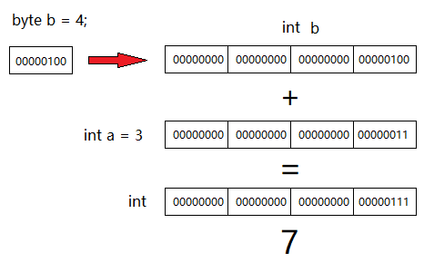
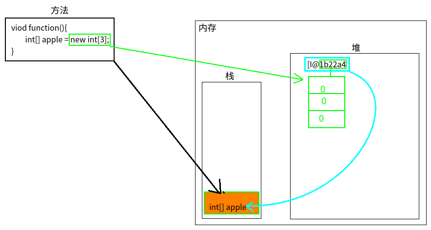
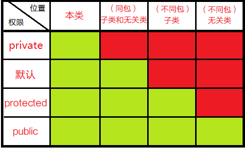

## 常量（constant）
<br>

### A. 字面常量
- 字符串常量（双引号括起来的内容）
- 字符常量（单引号括起来的单个字符、数字或符号，空格也算，不能为空）
- 整型常量（自然数例如12345等等）
- 浮点型常量（带有小数点的数字）
- 布尔常量（true真和false假）
- 空常量（null）

```java
class ConstantTest{
    public static void main(String[] args){
        System.out.println("abcd");// 字符串常量
        System.out.println('a');// 字符常量
        System.out.println(1234);//整型常量
        System.out.println(1.2);//浮点型常量
        System.out.println(true);// 布尔常量
        System.out.println(null);//空常量
    }
}
```
<br>

## 进制（scale）
### A. 理解

        1个开关有开和关两种状态表示0，1。计算机规定8个开关（0/1）为基本单位，称8bit（位）。
    
- 1byte（字节） = 8 bit（位）
- 1kbyte（千字节） = 1024 byte（字节）
- 1mbyte（兆字节） = 1024 kbyte
- 1gbyte（千兆字节） = 1024 mbyte
### B. 各种进制
- 二进制：0和1，逢二进一：1+1=10（二进制）=2（十进制）
- 八进制：0~7，逢八进一：1+7=10（八进制）=8（十进制）
- 十进制：0~9，逢十进一：1+9=10（十进制）
- 十六进制：0~9A~F，逢十六进一：1+F=10（十六进制）=16（十进制）
```java
class ScaleTest{
    public static void main(String[] args){
        /* java7之后 */
        System.out.println(0b10); // 前面加0b，二进制写法，输出2
        System.out.println(010); // 前面加0，八进制写法，输出8
        System.out.println(10);// 普通十进制
        System.out,println(0x10); //前面加0x，十六进制写法，输出16
    }
}
```
### C. 进制转换
1.  __X 进制转换为十进制__
- 系数：每位数（e.g. 123中的1、2、3）
- 基数：X进制，X为基数
- 权：从右数开始数，0开始编号（e.g 12345,权为4）
- 结果：SUM（系数 * 基数^权）

        二进制转十进制
        0b10010 = (1 * 2^4) + (0 * 2^3) + (0 * 2^2) + (1 * 2^1) + (0 * 2^0) = 18
        八进制转十进制
        01212 = (1 * 8^3) + (2 * 8^2) + (1 * 8^1) + (2 * 8^0) = 512+128+8 = 648
        十六进制转十进制
        0x2b = (2 * 16^1) + (11 * 16^0) = 43
2. __十进制转换为 X 进制__
- 公式： 十进制数值除以 X 进制直至商为0，再从下到上取其余数

    

3. __任意进制转换为任意进制__
> 8421 快速转换法：第3、2、1、0位对应的8、4、2和1

| 1 | 1 | 1 | 1 | 1 | 1 | 1 | 1 |
| - | - | - | - | - | - | - | :-|
| 1*2^7 | 1*2^6 | 1*2^5 | 1*2^4 | 1*2^3 | 1*2^2 | 1*1^7 | 1*0^7 |
| 128 | 64 | 32 | 16 | 8 | 4 | 2 | 1 |
||||||||
- 十进制快速转换为二进制：
    - 123比第7位的128小故取0
    - 123比第6位的64大故取1，且123-64=59
    - 59比第5位的32大故取1，且59-32=27
    - 27比第4位的16大故取1，且27-16=11
    - 11比第3位的8大故取1，且11-8=3
    - 3比第2位的4小故取0
    - 3比第1位的2大故取1，且3-2=1
    - 1和第0位的1相等故取1，且1-1=0
    - __结果：123 = 01111011__
- 二进制快速转换为八进制：
    - 1111011每3位为1单位：1、111和011
    - 第一个单位1对照表第0位的状态也是1，故取其值1
    - 第二单位111分别对应表的第0、1和2位，因其状态都为1，故取其值4+2+1=7
    - 第三单位的011分别对应表的第0、1和2位，因011的第2位为0，故不取表对应的第2位的值，所以剩下的1+2=3
    - __结果： 173__
- 二进制快速转换为十六进制：
    - 1111011每4位为1单位：111和1011
    - 第一单位1111对应表中的第0、1和2位，因为都为1，故取其值4+2+1=7
    - 第二单位1011同上，但有0的存在，所以对应表中相应第2位的值不取，剩下的8+2+1=11，即B
    - __结果： 0x7B__
- 十进制要想快速转换为其他进制，就要先转换为二进制。
#### D. 机器正负运算（原码、反码和补码）
- 原码：最高位存放正负，正为0，负为1
    - e.g. 1的正二进制为0001，负二进制为1001；同样3的正二进制为0011，负二进制为1011.
    - 方便人类快速识别二进制正负，但阻碍了计算机运算。
    - e.g. （+1）+（-1）应等0，但计算机算出0001+1001=1010。如果按照原码的方式看则为-2.明显不对。
    - __另一个问题是存在（+0）和（-0）两个0__
- 反码：专门用于处理负数，符号位置不变，其余位取反
    - e.g. 原码中负数1010（-2）转换为反码1101（-2）
    - 原码转换为反码，可以解决“正负相加等于0”
    - __但还剩下（+0）和（-0）的问题__
- 补码：在原来反码的基础上，补充或加上一个新的码（+1）
    - e.g. 反码中的负数1111（-0）加上（+1）转换为补码0000（0），1110（反码-1）转为1111（补码-1），其他依次类推。
    - 当反码1111（-0）补1之后，变成10000，丢掉最高位就是0000，干好是正数的0。
    - __正负数相加等于0的问题同样满足__
    - e.g. 3和（-3）相加，0011 + 1101 = 10000，去掉最高位，就是0000，全面解决问题！

    
- 正负运算：
    - 1减去3
    - = 1+(-3)
    - = 0001 + 1011 (原码)   
    - = 0001 + 1100 (反码)   
    - = 0001 + 1101 (补码)   
    - = 1110 (补码)，将其再转回原码：          
    - = 1101 (反码)          
    - = 1010 (原码，最高位1为负，010为2，故为-2)
- 已知补码，求原码：
    - __如果该补码的符号为正，则其原码就是这个补码__
    - __如果该补码的符号为负，则对该补码再次求补码就是要求的原码。__
- 负数的补码：
    - 对负数的绝对值二进制全部取反(包括符号位)再加1,则为该负数的补码
    - e.g. -35的补码
    - -35的的绝对值35的二进制为00100011
    - 全部取反为11011100
    - 再加1为11011101,这就是-35的补码
- A减去B = A加(-B)的补码（A、B>0）
- 反正运算时都得将参与运算的数转换为补码运算，最后结果转回原码，取正负和尾数就是答案。

<br>

## 数据类型
> Java设定具体的数据类型一个重要原因是可以更好地利用内存资源。
### A. 数据类型分类
__1. 基本数据类型（4类8种）__
- 整形
    - __byte：占一个字节(8bit)   （-128到127）__
    - short：占两个字节 （-2^15 ~ 2^15 - 1）
    - int：占四个字节 （-2^31 ~ 2^31 - 1）
    - long：占八个字节 （-2^63 ~ 2^63 - 1)
- 浮点型
    - float：占四个字节 （-3.403E38 ~ 3.403E38）单精度
    - double：占八个字节 （-1.798E308 ~ 1.798E308） 双精度
- 字符型
    - char：占两个字节  （0 ~ 65535）只有正的
- __布尔型__
    - __boolean：理论上占八分之一个字节(1bit位),但Java没有明确指定布尔型的空间大小。__

__2. 引用数据类型__
> - 数组
> - 类
> - 接口
> - 枚举

__3. 数据类型转换_隐式转换__
> 当取值范围大的数据类型和较之取值范围小的数据类型进行运算时，会先将小的数据类型转换为大的数据类型再进行运算。
```java
class DataTypeConversionTest{
    public static void main(String args[]){
        int a = 3;
        byte b = 5;     // 字面常量可以直接被JVM编译时识别，所以可以直接赋值给byte类型
        byte c = a + b; // 两个不同类型的变量进行运算，JVM编译时不知道运算结果是否超出所赋值的数据类型取值范围（因为运行才知道结果），所以通过报错来阻止可能发生的错误
        System.out.println(c);
        // 发生编译错误：不兼容的类型: 从int转换到byte可能会有损失
    }
}
```


__4. 数据类型转换_强制转换(取值范围大向取值范围小的转换)__

> 取值范围大的类型数据和取值范围小的类型数据运算结果为取值范围大的数据类型，如果将结果赋给范围小的类型声明的值，则需要在前面加“(数据类型)”来将范围大的类型数据强制转换为范围小的类型数据。
```java
class DataTypeConversionForce{
    /*强制转换*/
    DataTypeConversionForce(){
        int i = 3;
        byte b = 4;
        // 前面加上 (byte) 强制转换为byte类型
        byte result = (byte)(i + b);
        System.out.println(result);//输出7,因为7在-128到127之间，所以编译器允许赋值给byte类型。

        int i2 = 128;
        byte b2 = 10;
        byte result2 = (byte)(i2 + b2);
        // 输出是-118,因为i2+b2=138,已经超出byte的取值范围-128～127了，损失精度(砍掉前面三个字节)。

        byte b3 = (byte)300;
        //输出44
    }
}
```


> 上面例子，强制转换会将int类型(占4个byte)的result去掉前面的3个byte，只留下一个byte，就转变成byte类型了(占1个byte)。这样的话，如果result的值超过byte类型的空间大小(-128～127),即超过一字节，就会损失精度。

> 例如result2的结果竟是-118,这是因为机器运算得出的结果是10001010(138),这是-118的补码，将其补码转回原码就是-118了。

> b3的输出竟然是44,300的二进制是100101100，9位，因为int转byte会砍掉前面3个字节，所以最后只剩下 00101100，因为最高位为0即正数，所以求它的原码就是它的补码，00101100转为十进制为44.

<font color="red" size="4">__面试题_变量相加和常量相加对于类型转换的区别:__</font>
```java
void DataTypeConversionForce_2(){
        /*数据类型强制转换中的变量相加和常量相加*/
        byte b1 = 3;
        byte b2 = 4;
        /*报错，1、因为3和4是int类型，运算结果也是int。将int数据赋值给byte类型会损失精度
        * 2、 b1和b2是两个变量，编译时无法判断里面具体的值，要运算才知道结果，相加可能会超出byte范围，所以会报错。*/
        byte b3 = b1 + b2;

        /*常量相加*/
        byte b4 = 3 + 4;
        /*不报错，因为java编译器有常量优化机制
        * 编译时，可直接知到常量3和4,且不再改变，运算得出的结果如果判断超过byte
        * 范围，且未进行强制转换，则报错
        * 否则赋值*/
    }
```

__5. 不同数据类型的变量定义__

```java
class DataTypeDefineTest{
    public static void main(String[] args){
        /* 加上后缀只是告诉JVM这是什么类型的值，并没有强制转换的发生 */
        /* 整型 */
        byte b = 1; // 占一个字节 -128~127
        short s = 12; // 占两个字节  -2*10^15~2*10^15-1
        int i = 123; //所有整数值默认为int
        long l = 12344L; //因为所有整数值默认为int，最好加L后缀告诉JVM这是long，防止出错。不加也不影响，因为JVM会自动转换为long，前提是不超过取值范围

        /* 浮点型 */
        float f = 1.33F; //因为所有浮点型数值默认为double型，不加F标识的话以为着将double类型的值赋给float，报错
        double d = 2.333; //浮点型数值默认类型

        /* 字符型 */
        char c = 'c';

        /* 布尔型 */
        boolean tf = true;//或者false
    }
}
```
__6. 字符和字符串参与运算__
- 字符(char)类型数据与int类型数据相加，会先将字符根据ASCII码表转换为int类型数字，再和int类型数据运算。
    ```java
    char c = 'c'; // 'c'字符在ASCII码表中是99
    int i = 1;

    System.out.println(c+i);// 输出100，99+1=100
    System.out.println((char)(c+i));// 输出'd'字符，100对应
    System.out.println('a'+'c');//输出196,char一旦参与数学运算都将转换为int

    ```
    ```java
    char c1 = 97;
    char c2 = 98;
    System.out.println(c1);//输出a
    System.out.println(c2);//输出b
    /*为什么输出ab? 因为char的取值范围是0～65535, 97和98不超出
    * 范围，所以编译器将其当作ASCII码处理*/
    ```
    > java中的char可以储存一个中文字符么？为什么？

        可以，因为java采用Unicode编码。Unicode编码中的每个字符占2个字节，中文单个汉字也占2个字节，所以char可以储存一个中文汉字.

- 任何类型数据用 + 与字符串相连接都会产生新的字符串。按照运算优先级产生的内容也不相同。
    ```java
    /*任何类型数据用 + 和字符串连接(强调连接而不是运算)都产生新的字符串*/
    System.out.println("hello"+2); // 输出 hello2
    System.out.println("hello" + 'c'); //输出 helloc
    System.out.println("hello"+true); // 输出 hellotrue
    System.out.println(2 + 'c' + "hello");// 输出 101hello
    System.out.println("hello" + 2 + 'c');// 输出 hello2c
    System.out.println("5 + 5 = " + 5+5);// 输出 5 + 5 = 55
    System.out.println("5 + 5 = " + (5+5));// 输出 5 + 5 = 10,优先级
    ```
    > 注：因为是强调“连接”，而不是运算，所以字符char不会转换为int，这就是为啥输出helloc。

    > 一般按照从左到右执行，没有加括号的话。

<br>

## 运算符(operator)
> 对常量和变量进行操作的符号。
- 算术运算符：+、-、*、/、%、++、--
- 赋值运算符：=、+=、-=
- 比较(关系/条件)运算符：>、<、>=、<=、!=
- 逻辑运算符：&&、||
- 位运算符：>>、<<、>>>
- 三目(元)运算符
> 注意：+号三种作用，正、加法、字符串连接符
### A.算术运算符
__1. %(模，取余)：__
```java
void Demo(){
    /* % 模运算符，取余*/
    /* % 运算结果的正负根据左边值正负*/

    /*当左边值的绝对值小于右边绝对值时，结果为左边*/
    System.out.println(-3 % 5);//输出 -3
    System.out.println(-3 % -5);//输出 -3
    System.out.println(-12 % 5);//输出 -2

    /*当左边的绝对值等于右边或右边的倍数时，结果是0*/
    System.out.println(-9 % 3);// 输出 0
    System.out.println(-9 % -3);// 输出 0
    System.out.println(-3 % -3);// 输出 0

    /*当左边绝对值大于右边绝对值时，结果为余数*/
    System.out.println(-4 % 3);// 输出 -1
    System.out.println(4 % 3);// 输出 1
    System.out.println(4 % -3);// 输出 1
    
    /*奇数 %2 为1,偶数 %2 为0，,可用作切换条件*/
    System.out.println(4 % 2);// 输出 0
    System.out.println(5 % 2);// 输出 1
    System.out.println(6 % 2);// 输出 0
}
```
__2.　++a先自增,a++后自增(减):__
> 在未参与运算(或赋值)时，一般a++和++a的效果是一样的
```java
int i = 1;
i++; // 输出２

int j = 2;
++j; // 输出３
```
> 但一旦参与运算或赋值，a++就会先将ａ赋给目标，然后才自增；而++a则先自增后再赋给目标。
```java
int a = 1;
int b = a++; // 输出ｂ为１，ａ为２

int c = 1;
int d = ++c; // 输出ｄ为２，ｃ为２

int x = 1;
int y = (x++)+(++x)+(x*10);
/*　开始ｘ参与运算，先将x初始值取出(1)，然后自增，此时ｘ已经变成2。然后到第二步(++x),这里先自增x变成了3。第三步x*10则为30。所以最终结果为 1+3+3×10=34 */
```
<font color="red">__面试题_下面那一句会报错：__</font>
```java
byte b = 10;
b++;// 这等价于 b = (byte)(b + 1) JVM自动强制转换，所以这句不报错.
b = b + 1;// JVM会先将b(byte)变量提升为int然后再参与运算，结果为int，无法赋值给byte类型，需要手动强制转换
```

### B. 逻辑运算符
__1.异或(^)__
> 真假异或

    符号左右两边同为true或false时，则结果为false。
    否则两边分别是true和false时，则结果为true。
    总结：两者同则false，异则true
> 异或运算
```java
4 ^ 6:
= 100 ^ 110 (二进制)
= 010 (同则0,异则1)
= 2 (十进制)
```
__2.与(&/&&)、或(|/||):__
> 与&：两者同时成立则true，否则false

> 与&&：<font color="green">和&相同效果，但有短路功能=>A&&B，如果A判定为false，则不需要再判断B了，因为这足可以判定整个条件不成立了。</font>

> 或|：两者之一成立则true，否则false

> 或 ||：<font color="yellow">同上，A||B,如果A为true，则不需判断B了，因为已经有一个成立了，足以判断条件是否成立了。</font>
    
    短路功能可以节省计算资源。

### C.位运算符
> 位与运算：
```java
4 & 6：
= 100 & 110
= 100 (同1则1，否则0)和逻辑与一样
= 4
```
> 位或运算：
```java
例子：
4 | 6：
= 100 | 110
= 110 (有1则1,否则0)
= 6

// 简单模式
4 | -7：
= 100 | 001(-7的补码)
= 101 (结果也是补码，要转为原码)
= 110 (尾数取反，符号位不变)
= 111
= -3 (原码)
等价于：
// 具体模式
= 00000000 00000000 00000000 00000100 | 11111111 11111111 11111111 11111001
= 11111111 11111111 11111111 11111101
= 10000000 00000000 00000000 00000010
= 10000000 00000000 00000000 00000011
= -3
```
> 位取反运算：
```java
～4：
= 00000000 00000000 00000000 00000100
= 11111111 11111111 11111111 11111011 (取反运算:全体取反)，//这里是补码，需要转换为原码来看
= 10000000 00000000 00000000 00000100 (尾数位取反)
= 10000000 00000000 00000000 00000101 (补码)
= -5 (原码)
// 为什么这么多01,因为4是int类型，所以最高位是第31位即符号位
```
<font color="red">__面试题_实现两个变量的交换__</font>
```java
/* 异或运算的特点：
*  一个数A对另一个数B异或运算两次，还是这个数A,变回自己 */
// 推荐方案
int a = 10;
int b = 3;
a = a ^ b; // 10 ^ 3
b = a ^ b; // 10 ^ 3 ^ 3 = 10
a = a ^ b; // 10 ^ 3 ^ 10 = 3
// a = 3, b = 10 交换成功

// 另一个方案
a = a + b; // 10+3=13
b = a - b; // 13-3=10
a = a - b; // 13-10=3
// a=3, b=10 交换成功，但是缺陷是如果a和b运算结果超出int取值范围，就会报错

// 又一个方案
int temp = a; // temp=10
a = b; // a=3
b = temp; // b=10
// 开发推荐，但面试可能会限制这个中间条件
```
### D.位运算符（<<、>>）
__1.左移<<__

        二进制位向左移 N 位，等价于该数乘2的 N 次方，左边移出去N位，右边补N个0。
```java
12 << 1:
00000000 00000000 00000000 00001100 = 
00000000 00000000 00000000 00011000 = 24
    
```
__2.右移>>和无符号右移>>>__

        右移 N 位，等价于该数除以2的 N 次方，左边最高位若是1则补1,否则补0.
```java
12 >> 3:
00000000 00000000 00000000 00001100 = 
00000000 00000000 00000000 00000001 = 1

2147483656 >>> 1:无符号右移
10000000 00000000 00000000 00001000 = 
01000000 00000000 00000000 00000100 = 1073741828
```

<br>

## 键盘输入
- 导包：`import java.util.Scanner;`
- 创建扫描对象：`Scanner sc = new Scanner(System.in);`
- 通过该对象获取数据：`int x = sc.nextInt();//整型获取`

<br>

## 流程控制结构
- 顺序结构： 普通从上到下依次执行
- 选择结构： 也叫分支结构，if/else和switch语句
- 循环结构： for、while、do/while和foreach语句

### A.选择结构(分支结构)
#### 1. if/else语句：
- 格式1：
    ```java
    int age = 19;
    if (age >= 18){
        // 语句
    }
    ```
- 格式2：
    ```java
    // 不加大括号，则只控制离它最近的一句话，是一句话！！！
    if (age < 11)
        int a = 13; // 报错，因为该语句共两句，int a和a = 13
    ```
- 格式3：
    ```java
    if (条件1){
        //xx
    }else if(条件2){
        // xxx
    }else{
        //最后一个else可以忽略
    }
    ```
#### 2. switch语句：
- 格式：
    ```java
        switch(表达式){
            case 值:
                // 语句
                break;
            case 值2:
                // 语句
                break;
            default:
                // 语句
                break;
        }
    ```
    > - 表达式可以接受的基本数据类型：
    byte、short、char、int
    > - 可以接受String类型、枚举。<br>

    > 注意事项：
    > - case后面只能常量（或字面常量）
    > - 多个case后面的值不能重复
    > - 如果不加break，匹配完当前值后会继续向下穿透匹配，直至遇到break关键字或代码结束}。

<br>

### B. 循环结构
> 在循环体内可以通过 break 关键字停止整个循环;通过continue关键字可以直接执行下次循环。
#### 1. for循环
```java
for(初始化表达式; 循环条件; 循环后的操作表达式){
    // 循环体
}
```
- __流程：__
    - __a__ 初始化表达式执行（首次）
    - __b__ 判断循环条件
    - __b__ true则执行循环体,false退出循环
    - __c__ 执行完循环体执行循环后的操作表达式
    - 第二次循环从 b 步骤开始

`for(;;){} // 无限循环`

#### 2. while循环
```java
while(i < 100(判断条件语句)){
    循环体;
    i++/i--等(控制条件语句);
}
```
#### 3. do/while循环    
> 特别的是无论如何都会先执行一次循环体语句，然后才执行判断条件语句。较之for和while执行0次以上的循环体，do/while是执行1次以上循环体。
```java
do {
    循环体语句;
    控制条件语句;
}while(判断条件语句);
```
 - 流程
    - a.先执行循环体
    - b.执行控制条件语句变化条件
    - c.判断条件
    - true继续从a执行

__三种循环结构的区别：__<br>
        
    for循环：初始化的迭代变量循环完被释放，不再可用，而且外部无法调用迭代变量(局部变量)。
#### 4. 标号控制
合法的标号名加上冒号(apple:)
> 一般用于嵌套循环，控制外循环跳出(break)、跳过(continue)。
```java
static void ControlCycle(){
    /*标号控制一般用于控制外循环*/
    outer: for (int i = 0; i < 3; i++){
        System.out.println("外循环"+i);
        inner: for (int j = 0; j < 2; j++){
            System.out.println("内循环"+j);
            continue outer;
            // 或break outer;
        }
    }
}
```
<font color="red">__标号的陷阱__</font>
```java
System.out.println("第一句");
http://www.baidu.com
System.out.println("第二句");
输出：
    第一句
    第二句
/* "http:" 是个合法标号。而后面的网址是注释(坑)，两条斜杆。
* 标号控制的是第二句*/
```
<br>

## 方法
### 方法重载
> 方法名相同，参数不同，与返回值类型无关
- 参数个数不同
- 参数类型不同
```java
public void love(){}
public String love(int num){}
public int love(String name, int num){}
```
<br>

## 数组
> 引用数据类型
### 1.数组初始化
- 动态初始化(具体元素不确定)<br>
    > 数据类型[] 数组名 = new 数据类型[数组长度]
    ```java
    int[] apple = new int[3];
    /* int[] 一维数组
    *  int[][] 二维数组 */
    ```
    > 数组初始化会有默认值
    ```java
    整型：byte、short、int和long默认初始化值是0
    浮点型：float和double是0.0
    布尔：默认false
    字符：char默认值是'\u0000',
          char在内存中占两个字节，16个二进制位，
          \u0000,每个0是16进制的0,而一个16进制位用4个二进制位表示，转换为二进制\u0000 0000 0000 0000,16个0.
    ```
    > “new int[3]” 返回数组的信息：[I@7f31245a
    ```java
    [I@7f31245a
    [： 一维数组
    I:  int类型、byte则是B、short则是S、boolean则是Z等等
    @：固定格式
    7f31245a：内存地址值
    ```
- 静态初始化(元素确定)
    > 数据类型[] 数组名 = new 数据类型[]{元素1,元素2,...}
    ```java
    int[] apple = new int[]{1,2,3};
    ```

    简化格式
    > 数据类型[] 数组名 = {元素1,元素2,...}
    ```java
    int[] apple = {1,2,3};
    ```

    两种格式的区别：
    > 标准格式可以先定义：int[] apple;后赋值：apple = new int[]{1,2,3};<br>
    而简化格式则会出错。


### 3.堆栈
- 堆：存储new出来的数组或对象
- 栈：存储局部变量(定义在方法声明上和方法内的变量)，先进后出（先进的压箱底）
- 方法区：面向对象占位
- 本地方法区
- 寄存器：cpu使用


### 4.数组的操作
- 获取数组的长度
    ```java
    int[] apple = {1,2,3};
    int array_length = apple.length;
    ```
### 5.二维数组
#### 格式
- 数据类型[][] 数组名 = new 数据类型[m][n];
- 数据类型[] 数组名[] = new 数据类型[m][n];
- 数据类型[][] 数组名 = new 数组类型[m][];
    - 数组名[0] = new 数据类型[3];
    - 数组名[1] = new 数据类型[4];
    - .......
- 数据类型[][] 数组名 = {{1,2},{3,4,5},{6}};(静态)

#### 注意：
```java
int[] x,y[]; // x为一维数组，y为二维数组
x = new int[]{1,2,3};
y = new int[][]{2,3,4};
```
#### 二维数组的内存表现形式
> 二维数组创建时，第一维数组用于存储第二维数组的内存地址。
```java
int[][] apple = new int[3][2];
apple // [[I@1b2c3d 第一维数组的内存信息
apple[0] // [I@4c2a22 第一维数组的0索引位置存储的是另一个数组的内存信息。
```

### 6.数组作为参数在方法中的传递
> &nbsp;&nbsp;&nbsp;&nbsp;由于数组是引用数据类型，所以数组作为参数传递给方法时，实际上是将数组的内存地址传给方法。在方法内对数组进行的一切操作都会改变原数组，因为方法是根据传进来的原数组的内存地址来对原数组进行操作。
```java
static void changeArray(int[] arr){
    arr[0] = 1;
}

public static void main(String[] agrs){
    int[] a = {2};
    changeArray(a); // 传递的是a数组的内存地址
    System.out.println(a[0]); //输出 1
}
```

## 面向对象
### 程序执行时在JVM内存中如何表现的？
- __a__ 编译器将源代码编译成.class文件，即字节码文件,有多少个类就编译成多少个.class文件。
- __b__  首先是主类.class文件通过类加载器载入到内存的方法区(JVM)。
- __c__  方法区内，在静态区发现main主方法时，将main()压进栈内存区。
- __d__  main()进栈，执行main()里的语句：
    ```java
    public static void main(String[] args){
        Student student1 = new Student();// 执行到这句时，先在栈内存申请一块空间，名字叫student1，用来存储new返回的地址值。
    }
    ```
- __e__ 执行到new Student()时，类加载器将Student.class文件载入JVM内存方法区中，static静态变量也进行了默认初始化：
    ```java
    Student student1 = new Student();// 从方法区中找到Student类信息，然后在堆内存中申请一块空间，并依照这些类信息实例化出实体，里面存储的是对象属性，然后进行初始化工作。
    ```
- __f__ 这里还有一步，如果有static关键字修饰的静态变量显式赋值的话，在第一次实例化对象时就显式初始化静态变量。由于对象实体是根据类信息（在方法区）来构建，所以可以找到静态变量的地址，从而对它赋值，完成显式初始化：
    ```java
    private static String school = "九小"; // 类的第一次实例化时，就对静态变量显式初始化，这时在方法区的静态区的静态变量从null变成“九小”。
    ```
- __g__ 默认初始化：jvm先根据数据类型申请相应空间的内存，并将这空间置零（默认初始化）。
- __h__ （如果已经手动赋值）显式初始化即赋值给对象属性：
    ```java
    class Student{
        // 创建对象时的显式初始化
        private String name = "张三";
    }
    ```
- __i__ 调用构造函数初始化时，构造函数进栈，完成工作后出栈。
- __j__ 所有初始化完成后，返回地址给变量（局部的）Student s。
- __k__ 局部变量 s 指向的是对象的地址，通过地址可以直接操作在堆内存中的对象属性：s.name="张三";
- __l__ s调用study()时，study()从方法区中压进栈内存中。
- __n__ study()中隐藏着一个变量this，s调用study()方法时就将堆内存中的实体的地址赋予给this。study()方法就可以凭着地址去堆内存中找数据和操作数据。
- study()操作完后出栈。

[参考链接](https://www.cnblogs.com/wxw7blog/p/7349204.html)
### java的垃圾回收机制
> &nbsp;&nbsp;&nbsp;&nbsp;创建对象时，会在jvm的堆内存开辟一块空间储存对象的实体，并返回对象实体的内存地址。局部变量接收这个地址就可以调用这个对象。而一旦将null或者其他东西赋予给这个局部变量，就会覆盖掉前面记录的对象实体内存地址。这时位于堆内存中的对象实体没有任何变量指向或引用它，它就会成为垃圾，jvm的垃圾回收机制会在不定时回收这些垃圾。

> &nbsp;&nbsp;&nbsp;&nbsp;由于方法是在栈中工作的，执行完后就会弹栈，而在方法内定义的对象、变量等等都会消失。而方法内指向堆内存中的对象实体变成了垃圾，被jvm回收掉。

### 局部变量和成员变量
- 区别
    - 在类中的位置不同
        - 成员变量：在类之中方法之外
        - 局部变量：在方法中定义或声明
    - 在内存中的位置不同
        - 成员变量：在堆内存（属于对象范畴，对象进堆内存）
        - 局部变量：在栈内存（属于方法，方法进栈内存）
    - 生命周期不同
        - 成员变量：随着对象的创建而存在，消失而消亡
        - 局部变量：随着方法的调用而存在，调用完毕而消失。
    - 初始化值不同
        - 成员变量：有默认初始化值。
            ```java
            class A{
                public String name; // 定义未赋值
                public int age;
            }
            public class B{
                public static void main(String[] args){
                    A a = new A();
                    int test;
                    System.out.println(test); // 报错，未赋值
                    System.out.println(a.name); // 输出 null(String默认值)
                    System.out.println(a.age); // 输出 0(int默认值)
                }
            }
            // 各种类型的成员变量默认值
            // 整型的都是0
            // 浮点型的都是0.0
            // char是'\u0000'打印的是空格
            // 布尔的是false
            ```
        - 局部变量：没有默认初始化值，必须在使用前定义和赋值。
- 注意
    - 局部变量名和成员变量名可以一样，方法调用时采取就近原则

### 创建的对象作为参数传递给方法时
> &nbsp;&nbsp;&nbsp;&nbsp;对象作为参数传递给方法，实质是将对象在堆内存中的地址传给方法。(引用的传递)，这时方法内对传入的对象地址进行的操作都会改变堆中的对象。
```java
class A{
    public String name = "李四";
}

public class {

    public static void changeA(A a){
        a.name = "张三";
    }

    public static void main(String[] args){
        A a = new A();
        System.out.println(a); // 对象地址：A@7f31245a
        System.out.println(a.name); // 输出李四

        changeA(a);
        System.out.println(a); // 对象地址：A@7f31245a（对象地址不变，说明操作同一个对象）
        System.out.println(a.name); // 输出张三，对象a的属性name已经被改变
    }
}
```

### 匿名对象
> 没有名称的对象
- 匿名对象的应用场景
    - 匿名对象在调用方法时，仅仅调用一次。
        - 匿名对象只用完一次后就变成垃圾，被回收
        ```java
        new Student().study();
        // 因为new完没有将内存地址赋予给任何变量，所以一旦new完调用方法完毕后就变成垃圾了。
        ```
    - 匿名对象可以作为实际参数传递给方法
        ```java
        Teacher(new Student());
        ```
### 封装
> 隐藏对象的属性和实现细节，仅对外提供公共访问方式。
- 优点
    - 隐藏实现细节
    - 复用性高
    - 安全性高
### this关键字
> 对象本身的引用
    
        创建对象后，对象调用成员方法时，例如student.study(),study()方法有个隐藏的this，student对象调用的时候会将对象实体内存地址告诉study()中的this，study()方法就可以凭地址去找堆内存的对象实体进行操作。

> 用于区分成员方法的形参名和成员变量名。
```java
Student student = new Student();
student.setName("张三");

...

private String name;    // 成员变量

public void setName(String name){ // 形参（方法的局部变量）
    name = name; // 形参名和成员变量名相同了
    // 两者名称相同时会导致赋值成员变量失败，因为当成员变量和局部变量同名时，方法内部采取就近原则，先采用局部变量。所以上面的结果是 成员变量name还是null，并没有赋值。
    
}
```

### 构造方法
#### 格式
- 构造方法名必须和类名相同
- 一般为public修饰（提供给公共）
    - 可以是private（私有构造方法）
        - 如果类中所有方法都是静态方法，推荐私有化构造方法，这样就不能实例化对象了。
- 不可以写void，写void就不是构造方法
- 没有返回值，但可写“return;”可不写。

> 通过方法重载可以写多个参数列表不同的构造方法。
```java
Student student = new Student("张三",24);
Student student = new Student("李四",23, "女");

...

class Student{
    public Student(String name, int age){
        ...
    }

    public Student(String name, int age, String gender){
        ...
    }
}
```

> 如果不编写任何构造方法，系统会默认提供无参构造方法

> 一旦编写有参构造方法，系统便不提供默认构造方法，如果你在创建对象时不传入参数，就会报错，所以一般加上自己写的无参构造方法。
```java
class Student{
    public Student(String name){
        ...
    }
}

...

Student student = new Student();// 报错：实际参数列表和形式参数列表长度不同。
```
> __以上的问题可以解决，将形参设为[数据类型... 形参名]：__
```java
class Student{
    public Student(String... names){
        System.out.println(names[0]+names[1]);
    }
}

main(){
    Student student = new Student(); //不会报错
    Student student = new Student("张三","李四");//不会报错
}
/*
* “数据类型... 形参名” 这种形式可以接受0个或以上的参数，这样就不用定义构造方法时写多个无参构造方法，方法重载也方便。
*/
```

### 构造方法和setXXX()
#### 构造方法
- 在创建对象时对兑现熟悉初始化，初始化后的对象属性如果没有提供公共方法来修改，意味着初始化完就固定下来了。
#### setXXX方法
- 可以灵活的修改对象属性

### static关键字和静态变量
#### 静态变量在内存中的表现
- 类加载器加载.class文件（字节码）进JVM的方法区
    - 这时，类的静态变量进行默认初始化
- 实例化对象时，根据方法区的某个类的类信息，在堆内存中申请一块空间用来存储对象属性。
    - 这时，对类的静态变量进行显式初始化，即赋值。
- 实例化第二个对象，重复第二步。
    - 这时，已经不再对静态变量进行显式初始化了，因为已经被初始化过了，除非手动进行。这里也可以调用这个静态变量了。
- 实例化n个对象，都可以调用这个静态变量。

#### static关键字（静态变量）的特点
1. 随着类的加载而加载并默认初始化
2. __优先于对象存在__
    - 因为是先加载类，再到根据类信息实例化对象。
3. 被类的所有对象共享
    - 因为无论多少个对象都是根据方法区的类的信息实例化出来的，大家都可以访问静态区的静态变量
4. 可以通过类名来调用
    - 其实也可以通过对象调用
    - 推荐类名调用
    ```java
    class A{
        private static String name = "小明";
    }

    ...

    main(){
        A.name = "小红"; // 前面并没有实例化对象，这里却可以通过类名调用
    }
    ```

- 什么场景用静态变量？
    - 如果某个成员变量，无论多少个对象都一样的，则将该成员变量用static修饰变成静态变量。

- 注意事项
    - 静态成员方法无法访问非静态成员
        - 因为静态成员是随着类加载而加载，非静态成员则随着对象创建而存在，类加载优先于对象的创建，非静态成员可能都未存在就让静态方法给调用了，自然就无法调用啦。
    - 静态方法只能访问静态成员（成员变量和成员方法）。

- 静态变量和成员变量的区别
    - 所属不同
        - 静态变量属于类，亦称类变量
        - 成员变量属于对象，亦称实力变量
    - 内存中的位置不同
        - 静态变量存储在方法区的静态区
        - 成员变量则存储在堆内存
    - 在内存中出现的时间不同
        - 静态变量随着类的加载而存在，随着类的消失而消失
        - 成员变量随着对象的创建而存在，消失而消失
    - 调用方式不同
        - 静态变量可以通过类名来调用，也可以通过对象来调用
        - 成员变量只能通过对象来调用

### 主方法main()
```java
public class Main{
    public static void main(String[] args){
        //
    }
}
```
- public
    - 需要被JVM调用，所以权限必须要大
- static
    - JVM调用，应该直接通过类名来调用，不用再去实例化对象调用。
- void
    - JVM调用main()不需要任何返回值，因为返回值也不知道给谁用。
- main
    - 不是关键字,只是JVM识别的固定函数名

### 说明文档的生成
#### 步骤
- 在源代码首部位置添加注释：
    ```java
    /**
    这是该类的功能介绍
    @author [作者]xxx
    @version [代码版本]v1.0
    */
    ```
- 在每个方法前面添加注释：
    ```java
    /**
    这是该方法的功能说明
    @param [参数说明]arr [这里写参数说明]
    @return [返回值说明]xxx [这里写返回值说明]
    */
    ```
- 用javadoc命令生成说明文档
    ```shell
    $ javadoc -d [指定生成目录] -author -version [java源文件]
    ```
    > 需要注意的是，java文件中的类得是public修饰。
- 生成后，打开前面指定的目录，里面有个index.html,打开即可查看。

<br>

### 代码块
> 格式：
```java
{
    // 代码
}
```
#### 局部代码块
- 在方法内部使用，限定变量生命周期，及早释放，提高内存利用率：
    ```java
    public void test(){
        {
            int x = 520; // 大括号外面无法调用
        }
        System.out.println(x);// 找不到符号错误
    }
    ```
#### 构造代码块（初始化块）
- 在类之中在方法之外；如果多个构造方法中都有相同的代码，将这代码提取成构造代码块
    ```java
    class Student{
        {
            System.out.println("我在学习");
        }

        public Student(){
            System.out.println("我在学习"); // 这代码大家都有，作为构造代码块方便。
        }

        public Student(String name){
            System.out.println("我在学习"); // 这代码大家都有，作为构造代码块方便。
        }
    }
    ```
- __每次创建对象都会执行。JVM会先将代码块的语句移到构造方法里，并放在构造方法原来的代码前按顺序执行：__
    ```java
    class A{
        {
            System.out.println("我是构造代码块，我会被JVM放进构造方法里执行");
        }

        public A(){
            System.out.println("我是构造方法");
        }
    }
    等价于
    class A{
        
        public A(){
            System.out.println("我是构造代码块，我会被JVM放进构造方法里执行");
            System.out.println("我是构造方法");
        }
    }

    ```
    <font color="yellow">注意：成员变量的初始化工作也被JVM移到构造方法内执行哦！</font>

#### 静态代码块
- 在类之中在方法之外；以static修饰。首次实例化对象时，优先于构造方法执行，如果还有其它静态变量，则看谁在上谁先执行。并且只执行一次，无论创建多少次对象：
    ```java
    class Student{
        static{
            System.out.println("静态代码块只行一次，无论创建多少个对象");
        }

        public Student(){}
    }
    ```
- 一般用于加载驱动
#### 代码块的优先级
1. 静态代码块（只在首次创建对象时执行一次）
2. 静态变量常量（只在首次创建对象时执行一次）
3. 构造代码块
4. 构造方法

<br>

### 继承
> 类如果没有用extends关键字继承任何类，它默认都是继承Object类，Object类是最顶类：
```java
class A {
    ....
}
等价于
class A extends Object{
    ...
}
```
> 实例化对象时，会先调用父类的构造方法对父类中的数据进行初始化赋值，然后才能让子类可以继承父类的数据并使用这些数据。

- 继承的好处
    - 提高代码的复用性
    - 提高代码的维护性
    - 多态的前提
- 继承的弊端
    - 类的耦合性增强（父类发生改动，子类跟着改动）
        - 耦合：两者之间的关系
        - 内聚：个体可以自身单独完成功能

<br>

#### JAVA继承的特点
- 只支持单继承。（一个子类只能继承一个父类）
- 支持多层继承（形成继承体系）

<br>

#### JAVA继承注意事项
- 子类只能继承父类的非私有成员（非private修饰）
- 子类不能继承父类的构造方法，但可通过 super 关键字来访问。

<br>

#### 关于继承中的构造方法
- 子类在实例化对象时，无论调用该子类中的任何构造方法，都会先调用父类的无参构造方法。但如果父类已经存在有参构造方法（即意味着JVM将不提供默认无参构造方法），又不手动给父类提供无参构造方法，编译会出错：
    ```java
    class A{
        public A(){
            // 手动提供无参构造方法
            System.out.print("A的无参构造方法");
        }

        public A(String name){
            // 有参构造方法一旦存在，jvm就不会提供默认无参构造方法了
            System.out.println("A的有参构造方法");
        }
    }

    class B extends A{
        public B(){
            // 无论子类哪个构造方法，都会先隐藏调用父类的无参构造方法
            // super()
            System.out.println("B的无参构造方法");
        }

        public B(String name){
            // super(); 默认隐藏调用父类的无参构造方法
            System.out.println("B的有参构造方法");
        }
    }

    /* new B():
    输出结果：
        A的无参构造方法
        B的无参构造方法

    new B("haha"):
    输出结果：
        A的无参构造方法
        B的有参构造方法
    
    一旦注释掉A的无参构造方法，而A也存在有参构造方法，jvm不提供无参构造方法。这时就会编译不通过。
    */
    ```
    疑惑：默认无参构造方法是用来给成员变量默认赋值的，那如果类没有成员变脸呢?

    - 为什么都会访问到父类的默认无参构造方法？
        - 因为子类继承了父类的可继承数据，也可能会使用到继承下来的数据，所以要想使用父类的数据就要初始化这些数据。

<br>

#### 父类和子类的成员变量关系
- 如果父类和子类有相同的成员变量，则优先使用子类的成员变量。

<br>

#### this和super
- 调用成员（成员变量和成员方法）
    - this.成员
        - 调用本类的成员，也可以调用父类的成员（前提是本类没有和父类相同的成员）
    - super.成员
        - 调用父类的成员变量
- 调用构造方法
    - this(...) 调用本类的构造方法
    - super(...) 调用父类的构造方法

- 如果父类没有无参构造方法，就调用他的有参构造方法
    - super
    ```java
    class A{
        public A(String name){
            // xxx
        }
    }

    class B extends A{
        public B(){
            super("张三"); // 必须放在第一句
            ...
        }
    }
    ```
    - this
    ```java
    class A{
        public A(String name){
            ...
        }
    }

    class B extends A{
        public B(){
            this("张三"); // 必须放在第一句
        }

        public B(String name){
            super(name);
        }
    }
    ```

<br>

#### 继承面试题
```java
main(){
    Zi z = new Zi();
    // 执行结果？
}

class Fu{
    static {
        System.out.println("Fu静态代码块");
    }

    {
        System.out.println("Fu构造代码块");
    }

    public Fu(){
        System.out.println("Fu 构造方法");
    }
}
class Zi extends Fu{
    static{
        System.out.println("Zi 静态代码块");
    }

    {
        System.out.println("Zi 构造代码块");
    }

    public Zi(){
        System.out.println("Zi 构造方法");
    }
}
/*
输出结果：
    Fu静态代码块
    Zi静态代码块
    Fu构造代码块
    Fu 构造方法
    Zi 构造代码块
    Zi 构造方法
*/
```
- 步骤
    - 实例化对象时，先将父类.class加载进来，静态代码块随着加载。输出 [Fu静态代码块]
    - 然后加载子类.class，子类的静态代码块随着加载，输出 [Zi静态代码块]
    - 然后进入子类的构造方法内，迎头撞来的是父类的构造方法（super()）。
    - 进入父类的构造方法，但JVM会先将构造代码块里的代码和成员变量（如果有）放进父类构造方法里原代码的前面执行，输出[Fu构造代码块]。
    - 执行完构造代码块的代码，接着轮到父类构造方法原本的代码，输出[Fu 构造方法]。至此，父类的初始化工作全部完成，子类可以愉快地使用父类的数据了。
    - 执行完父类的构造方法，就轮到子类了，JVM照样将子类的构造代码块的代码和成员变量（如果有）放进子类构造方法里的原代码前面，输出[Zi 构造代码块]。
    - 子类构造代码块的语句执行完，顺序轮到子类构造方法原来的语句，输出[Zi 构造方法]。至此子类的所有初始化工作也完成了。

<br/>

#### 方法的重写
> 子类和父类有相同名称的方法，称方法重写
- 注意事项
    - 子类不能重写父类的私有方法
        - 因为根本无法继承父类的私有方法，何来重写。
    - 子类重写父类的方法，权限不能比父类的方法低，最好一致。
        - 因为继承是为了扩展父类的功能，实现比父类更加强大，如果降低权限，使用起来就不方便，何不直接使用父类的方法。
    - 父类的静态成员只能由子类的静态成员覆盖，非静态成员无法覆盖父类的静态成员。（是覆盖，不是重写）
    - 子类重写父类方法，必须返回值类型一致。

- 方法重写的面试题
    - 方法重写（Override）和方法重载（Overload）的区别。
        - 方法重载可以改变返回值类型
            - 因为方法重载只跟参数列表有关
        - 方法重写一般不可以改变返回值类型，同父类一致返回类型。
    - 子类调用方法的时候
        - 先找子类本身，再找父类。

<br>

### final关键字
- 特点
    - 修饰类，类不能被继承
        ```java
        final class Student{...}
        ```
    - 修饰变量，变量变常量，只能被赋值一次
        - 必须被显式赋值
        - 一般和public static配合使用。
        ```java
        public static final String NAME = "123";
        ```
    - 修饰方法，方法不能重写
        ```java
        public final void print(){...}
        ```
    - 修饰引用数据类型，地址值不可被改变，但还能操作对象属性。
        ```java
        final Persion p = new Persion();
        p = new Persion(); // 报错，不可改变地址值
        p.seteName("张三");// 可以操作对象属性
        ```
    - 修饰方法参数列表：
        ```java
        public void method(final int x){
            ...
        }
        method(10); // 执行完弹栈，局部变量随之消失
        method(20); // 在次调用，新的方法进栈
        /*
        输出：
            10
            20
        因为方法使用完弹栈，局部变量消失，这时就可以重新给x赋值，意义不大。
        */
        ```
- final修饰变量的初始化时机
    - 显式初始化
        ```java
        class Demo{
            final int num = 1;
            // final int num; 默认值无效
        }
        ```
    - 对象构造完毕前
        ```java
        class Demo{
            final int num;

            public Demo(){
                this.num = 1; // 这里初始化
            }
        }
        ```

<br>

### 多态
- 前提
    - 有继承关系
    - 有方法重写
    - 有父类引用指向子类对象（动态链接/绑定）
        ```java
        main(){
            Cat cat = new Cat(); // 猫是猫
            Animal cat = new Cat(); // 父类引用指向子类对象（猫是动物）
        }

        class Animal{
            public void eat(){
                System.out.println("动物吃饭");
            }
        }
        class Cat extends Animal{ // 继承关系
            public void eat(){    // 方法重写
                System.out.println("猫吃饭");
            }
        }
        ```
- 总结（非静态成员）
    - 如果使用父类类型的引用指向子类的对象：
        - 则这个引用只能调用父类中定义的方法和变量，还有子类重写父类的方法。（动态绑定）
        - 若子类中重写了父类中的一个方法，那么调用这个方法的时候，将会调用子类重写后的方法。
        - 父类的变量不能被重写（覆盖），因为“重写”的概念只针对方法。
        - 若想调用子类自己的方法或变量（父类并没有），则需要强制转换为子类引用。
            ```java
            Animal cat = new Cat();
            ((Cat)cat).method();// 该方法父类没有
            ((Cat)cat).name;// 该变量父类没有
            ```
        - 若在子类重写父类的方法（参数列表发生变化），这就相当于新的子类方法，和父类同名的方法没有关系，所以需要转换为子类引用才能调用。
            ```java
            main(){
                Animal cat = new Animal();
                cat.eat();// 调用的是父类的方法
                (Cat(cat)).eat("鱼"); // 调用子类的方法
                /*
                输出：
                    吃东西
                    猫吃鱼
                */
            }


            class Animal{
                public void eat(){
                    System.out.println("吃东西");
                }
            }

            class Cat extends Animal{
                public void eat(String foot){
                    System.out.println("猫吃"+foot);
                }
            }
            ```
- 多态中的静态成员
    - 父类类型引用指向子类对象：
        - 无法调用子类重写父类的静态方法，只调用了父类的静态方法（和非静态方法的不同）。
            ```java
            Product pc = new PC();
            pc.use();// 实际是Product.use()
            PC pc1 = new PC();
            pc1.use(); // PC.use()
            ```
        - 调用静态变量也一样，父类类型引用则[父类.静态变量]；子类类型引用则[子类.静态变量].

#### 多态的优缺点
- 优点
    - 提供代码维护性（继承前提）
    - 增强代码扩展性（父类类型引用指向子类对象）
        - 在参数列表方面表现，作为形参，可以接受任意子类对象：
        ```java
        main(){
            method(new B()); // 父类引用可以接受任意子类对象
            method(new C());
        }
        public void method(A abc){
            // instanceof 关键字可以判断引用是否和对象类型一样
            if(abc instanceof B){
                B b = (B)abc; // 如果传入的对象是B类型，就强制转换为B类型，这样就可以调用他特有的方法了。
            }
        }
        ...
        class A{}
        class B extends A{}
        class C extends A{}
        ```
- 缺点
    - 不能调用子类特有的方法

> 关键字 instanceof 用于判断引用是否于对象的类型一样。

#### 多态题目
```java
main(){
    A x = new B();
    x.show();

    B y = new C();
    y.show();

    /*
    输出：
        爱
        你
    */

}
class A{
    public void show(){
        this.show2();
    }
    public void show2(){
        System.out.println("我");
    }
}

class B extends A{
    public void show2(){
        System.out.println("爱");
    }
}

class C extends B{
    public void show(){
        super.show();
    }
    public void show2(){
        System.out.println("你");
    }
}
```
- 步骤：
    - x.show(), B类对象自己并没有show()，所以不存在重写父类show()事情发生,但是继承下了A的show()，所以A类引用就调用自己的show()。
    - A中的show()，执行到this.show2(),调用自己的show2(),但show2()被子类重写，所以调用重写后的show2(),输出 爱。
    - y.show(),C类对象有自己的show(),父类B也有show(),发生重写事件，B类引用调用重写后的show().进入下一步
    - 调用C重写B的show(),执行super.show(),即调用父类B的show()方法。
    - 调用B的show()方法，但B自己没有show(),就调用从A继承下来的show().
    - 调用A的show(),执行到this.show2(),即调用自己的show2(),但这个show2()已经被继承到B，B又被继承到C，同时又重写了show2(),所以调用重写后的show2(),输出 你。

<br>

### 抽象（abstract）
- 可修饰类，称抽象类
    ```java
    abstract class 类名{}
    ```
- 可修饰方法，称抽象方法
    - 没有具体的代码实现，连大括号都没有。
    ```java
    public abstract void method();
    ```

- 特点
    - __抽象类不一定有抽象方法。__
    - __有抽象方法的类一定是抽象类或接口__
    - __抽象类不能实例化对象，但：__
        - __继承抽象类后，用多态的方式实现具体的子类实例化（抽象类既然不能实例化，但可以作为引用），这就抽象类多态。__
            ```java
            main(){
                Animal cat = new Cat();
                cat.eat();
                // 输出 猫吃鱼
            }
            ...
            abstract class Animal{
                public abstract void eat();
            }

            class Cat extends Animal{
                public void eat(){
                    //猫吃鱼
                }
            }
            ```
    - __抽象类的子类__
        - 要么是抽象类
        - 要么重写抽象父类中的所有抽象方法
        - 两者如果都满足，则无法实例化，无意义。
    - 抽象类和普通类一样有成员变量和常量，但不能被abstract修饰，即没有抽象成员变量。
    - 抽象方法也有构造方法，用于初始化自己的数据，便于被子类使用。

- 抽象类的成员方法特性：
    - 抽象类中的抽象方法是一定要强制子类进行重写的，要么就是子类变成抽象类。（像太子要想继承皇帝的江山，就必须按照皇帝要求做一些事情，例如读书识字）
    - 非抽象方法，子类可以原封不动拿来用，也可以在其基础上扩展功能。（太子继承皇位，便起用自己的心腹，或在旧的政策上面做出改进，然后可千世万世）
#### 面试题
- 抽象类如果没有抽象方法，可否定义为抽象类？可以则意义何在？
    - 可以
    - 目的是不让实例化这个抽象类，而只能由抽象类的子类来实现实例化。
- __abstract 不能和哪些关键字共存？__
    - __static静态修饰符__
        - 因为静态成员方法可以通过[类名.静态方法]的方式调用，
        - 而abstract修饰的抽象方法不许有方法体，调用无意义。
    - __final__
        - 因为final修饰的方法不能被子类重写。
        - 而abstract修饰的抽象方法，子类必须要重写，两者矛盾。
    - __private私有修饰符__
        - 因为private修饰的私有方法不能被子类继承和访问，
        - 而abstract修饰的抽象方法，必须对子类开放权限并重写，子类无法访问又如何重写。

<br>

### 接口（interface)
> 接口里的方法全都是抽象的，所以接口也是抽象的

> 广义角度是对外提供规则

#### 格式
```java
interface 接口名{} // 定义接口

class B implements 接口名{} // 类实现（应用）接口
```

- 接口不能实例化
    - 只能按照多态方法让implements(应用)接口的类来实例化(和抽象类一样)
        ```java
        main(){
            A a = new B(); // 父类引用子类对象
        }

        interface A{}

        class B implements A{}
        ```
#### 接口的成员特点
- 成员变量
    - 只能是常量（final）
        - 系统会自动给成员变量添加final修饰。
    - 只能是静态（static）
        - 系统会自动给成员变量添加static修饰。
    - 只能是公开（public）
        - 系统会自动给成员变量添加public修饰。
- 构造方法
    - 接口没有构造方法
- 成员方法
    - 只能是abstract修饰的抽象方法
        - 系统也会自动加上abstract修饰。
    - 只能是公开方法
        - 系统会自动添加public修饰
> 概括：接口的成员全都是公开的。

#### 类和类，类和接口，接口和接口的关系
- 类和类
    - 继承关系
    - 只能单继承，但可多层继承
- 类和接口
    - 实现或应用关系
    - 类可以实现或应用多个接口（多实现）
        ```java
        class A implements B,C,D {}
        ```
    - 还可以继承一个类同时实现多个接口
        ```java
        class A extends B implements C,D,E {}
        ```
- 接口和接口(继承关系)
    - 接口可以继承接口
        ```java
        interface A extends B {}
        ```
    - 还可以多继承
        ```java
        interface A extends B,C,D {}
        ```
    - 继承后需要重写所有抽象方法么？
        - 不需要，但可以重写。因为大家的方法都是抽象的，不能有方法体，重写没意义。

#### 抽象类和接口的区别
- 成员变量
    - 抽象类    
        - 抽象类有变量和常量（final）
        - 这些变量和常量可以被public,private,protect修饰。
        - 可静态也可非静态
    - 接口
        - 只有常量
        - 只能被public修饰
        - 只能静态static修饰
- 成员方法
    - 抽象类
        - 可以是抽象方法，也可以是非抽象方法。
    - 接口
        - 只能全部是抽象方法。
- 构造方法
    - 抽象类__有__构造方法
    - 接口__没有__构造方法

- 设计理念
    - 抽象类
        - 抽象类定义的继承体系中的共性功能。
    - 接口
        - 接口定义的是继承体系的扩展功能
            - 实现多个接口，扩展了功能

#### 猫狗案例
        动物固有的共性：名字，吃饭，睡觉
        猫被训练跳高

```java
main(){
    JumpCat cat = new JumpCat("Tom");
    cat.eat();
    cat.sleep();
    cat.jump();
}

abstract class Animal{
    private String name;
    public Animal(){}
    public Animal(String name){
        this.name = name;
    }
    // 动物必须吃饭和睡觉，但吃饭睡觉形式众多
    public abstract void eat();
    public abstract void sleep();
}

class Cat extends Animal{
    public Cat(){}
    public Cat(String name){
        super(name);
    }
    public void eat(){
        // 猫吃鱼
    }
    public void sleep(){
        // 猫趴着睡觉
    }
}

interface Jump{
    public abstract void jump(); // 跳高功能
}

class JumpCat extends Cat implements Jump{
    public JumpCat(){}
    public JumpCat(String name){
        super(name);
    }
    public void jump(){
        // 猫跳高
    }
}
```
<br>

### 包（package）
> 实质是文件夹
#### 格式
```java
package 包名; // 必须是程序的第一行可执行语句
package A.B.C; // 多级包名，用点分开
```
- 注意
    - package语句在一个java文件中只能有一个
    - 如果不加package，默认表示无包名

#### 编译和运行带包语句的java文件

```java
// Animal.java
package A.B.C;
...
```
- 编译
    - 命令行去到Animal.java文件所在目录
    - 执行命令
        - javac -d . Animal.java
    - 这时会在该目录生成A文件夹，在A文件夹里有B文件夹，在B文件夹里有C文件夹，Animal.class字节码文件旧存在C文件夹里。
- 运行
    - 命令行去到Animal.java文件所在目录
    - 执行命令
        - java A.B.C.Animal
    - 不能进入C目录执行该命令，会出现无法找到主类错误。
    - 必须在和A同路径下执行该命令，或者在哪里执行的编译命令，就在哪里执行运行命令。
        > 概况：即严格按照package语句所表明的路径进行运行
#### import导包
格式：
```java
import A.B.C.Animal; // 推荐方案
import A.B.C.*;// * 号通配符，JVM会到包下搜索，一旦匹配便对调用者可见，但如果包里有较多的类，则效率较低
```
> 用import导包，则调用式不用再写全类名。
- 面试题
    - package、import和class的顺序关系
        - package第一，import次之

<br>

#### private、默认、protected和public权限控制


- 无关类即两个类无没有继承关系，平级

__注意__
- 类只能由public和默认修饰，不能由private和protected修饰除了内部类。
- 而private和protected用于修饰类内部成员方法和成员变量，还有内部类。
- > 总之private和protected在类的内部才发挥效果。

<br>

### 内部类
- 内部类可以直接访问外部类的成员，包括私有
- 外部类要想访问内部类的成员，必须创建对象。
    - 外部类名.内部类名 对象名 = 外部类对象.内部类对象;
        ```java
        Outer.Inner oi = new Outer().new Inner();
        ```

#### 使用私有内部类
```java
class Outer{
    private int num = 10;
    private class Inner{
        private void method(){
            System.out.println(num);
        }
    }

    public void print(){
        Inner i = new Inner();
        i.method();
    }
}
```

#### 静态成员内部类
> 在类中存在static修饰的内部类

```java
main(){
    // 静态内部类的调用
    // 外部类.内部类 对象名 = new 外部类.内部类构造方法
    Outer.Inner oi = new Outer.Inner();

    // 静态内部类的静态方法的调用
    Outer.Inner2.print();
}
class Outer{
    // 静态内部类
    static class Inner{
        public void method(){
            //
        }
    }

    static class Inner2{
        // 静态内部类的静态方法
        public static void print(){
            //
        }
    }
}
```

#### 内部类面试题
依次输出 30,20,10
```java
class Outer{
    public int num = 10;
    class Inner{
        public int num = 20;
        public void show(){
            int num = 30;
            System.out.println(num);
            System.out.println(this.num);
            System.out.println(Outer.this.num);
        }
    }
}
```

#### 局部内部类访问局部变量的问题
> 在方法内部的类称局部内部类，只能在所在的方法内使用（实例化）
```java
class Outer{
    public void localMethod(){
        int num = 10; // JDK1.8会自动加上final，jdk1.7不手动加会报错。
        class LocalInner{
            public void access(){
                System.out.println(num);
            }
        }

        LocalInner li = new LocalInner();
        li.access();
    }
}
```
- 为什么局部内部类访问局部变量，这个局部变量要final修饰成常量？
    - 因为当调用这个方法时，该局部变量如果没有final修饰成常量，那么它的生命周期是随着方法调用完毕而消亡。而局部内部类所创建的对象可能并未回收，而且可能还想调用这个局部变量，但局部变量已经消失。所以就无法调用一个不存在的变量。
    - 把该局部变量修饰成常量，就会赋值一份到方法区的常量池，保证了局部内部类对象可继续调用。
    - JDK1.8新特性，如果自己不加final，JVM会自动帮你添加。

__疑惑__:<br>
局部内部类的对象引用作为局部变量（例如上面的li）存在于方法内，当方法执行完毕弹栈，这个li也随之消失了，即使堆内存仍然存在局部内部类对象，但都没有引用指向它了，这个对象不就成了垃圾了么，怎么还会有可能调用这个方法的其他局部变量？

<br>

#### 匿名内部类
> 匿名内部类实际上是简化了代码，将继承或实现和创建子类一起做了。
- 前提
    - 存在一个类（具体类或抽象类）或接口  
- 格式
    ```java
    new 类名或接口名(){
        重写方法;
    }
    ```
- 本质
    ```java
    interface A{
        public void print();
    }

    class B {

        class C implements A {
            public void print(){
                Sysem.out.println("CA");
            }
        }

        public void method(){
            new C().print(); // [new C()]代表着接口A的子类C的对象，并且调用了重写后的方法。
        }
    }

    /*class B 相当于:*/

    class B {

        public void method(){
            /*
            new A():
                意思是创建了一个类实现接口A，但这个类没有类名（匿名）。因为是接口，所以要重写该接口的抽象方法print()。所以new A()就是一个实现了接口的匿名类所实例化的匿名类对象。这个匿名类对象调用重写的方法。
            */
            new A(){
                public void print(){
                    Sysem.out.println("CA");
                }
            }.print();
        }
    }
    ```

- 重写多个方法的问题
    ```java
    interface A {
        public void show1();
        public void show2();
    }

    class B {
        public void method(){
            // 普通形式只能每次调用一个重写方法
            new A(){
                // 重写了多个抽象方法
                public void show1(){
                    // 输出show1
                }

                public void show2(){
                    // 输出show2
                }
            }.show1();

            // 多态形式
            A a = new A(){
                public void show1(){
                    // 输出show1
                }

                public void show2(){
                    // 输出show2
                }
                // 匿名内部类自己特有的方法
                public void show3(){
                    // 输出show3
                }
            };
            // 可以调用多个，
            a.show1();
            a.show2();
            // 但不能调用匿名内部类自己特有的方法，因为匿名内部类不能向下转型（匿名内部类没有类名）：
            // a.show3();
        }
    }
    ```
    - 所以匿名内部类只针对重写一个方法时使用。
- 匿名内部类再开发中的应用
    - 当一个方法需要传递一个对象作为参数时，而且这个对象要求是某个接口或者类的子类对象。可用匿名内部类：
        ```java
        main(){
            PersionDemo pd = new PersionDemo();
            pd.method(new Persion(){ // 传入匿名内部类对象
                public void show(){
                    // 输出 show
                }
            });
        }

        abstract class Persion {
            public abstract void show();
        }

        class PersionDemo {
            public void method(Persion p){ // 要求是某个接口或类的子类对象
            p.show();

            }
        }
        ```
__匿名内部类的面试题：__<br>
```java
main(){
    /*题目：用以下语句输出helloworld*/
    Outer.method().show();
    // 实际上可以将上面代码拆解：
    Inter it = Outer.method();
    it.show();
    /* Outer.method() => new Inter(){
        public void show(){
            System.out.println("HelloWorld");
        }
    };
    */

}

interface Inter {
    void show();
}

class Outer {
    // 填空：补齐代码
    // 答案：
    public static Inter method(){
        return new Inter(){
            public void show(){
                System.out.println("HelloWorld");
            }
        };
    }

}
/*分析：
    [Outer.method()]意味着method是静态方法，可以通过类名调用。
    [Outer.method().show()]:Outer调用method方法之后还可以调用show方法，这意味着Outer.method()的结果是返回一个对象。这个show方法是接口Inter的方法，所以Outer.method()返回的是Inter对象。又因为Inter是接口，不能实例化对象，所以只能是实现了Inter接口的类的对象。
    所以，结果是返回了匿名内部类对象。
*/
```

<br>

### Object

#### hashCode()
- 获取对象的哈希值(对象的地址值)，int
- 该方法是用本地资源计算（native修饰）
```java
Student s = new Student();
sout(s.hashCode());
```

#### getClass()
- 返回对象的运行时类，返回类型 Class
- Class 类型，描述类的类，返回字节码文件
```java
Student s = new Student();
Class clazz = s.getClass(); // 获取对象的字节码文件，返回Class类型的对象
String className = clazz.getName(); // 获取类名。

Class clazz = new Class();// 不可行，需要通过某个对象来反求字节码文件。
```

#### toString();
- 返回String 字符串
- 返回的结果有三个部分：
    ```java
    // 源码
    public String toString(){
        return this.getClass().getName() + "@" + Integer.toHexString(this.hashCode())
    }
    /*返回结果：
        左边：类名，this.getClass().getName()
        中间：@
        右边：对象的哈希值（地址值）十六进制形式
    */
    ```
- 给方法的作用是可以更方便的显示属性值：
    ```java
    class Student {
        
        @Override
        public String toString(){
            return "我的名字是"+this.getName()+", 我的年龄是"+this.getAge();
        }
    }
    ```

#### equals()
- 对比两个对象的地址值是否相等（是否同个对象），返回true/false
    ```java
    // 源代码：
    public boolean equale(Object ojb){
        return (this == obj)
    }
    ```
- 重写该方法使其更具意义（对比两个对象的属性是否一致）
    ```java
    class Student {

        @Override
        public boolean equals(Object obj){
            return (this.name == (Student)obj.name) && (this.age == (Student)obj.age);
        }
    }
    ```
- equals()和 ”==“的区别
    - 共同点
        - 比较功能，返回值为布尔类型
    - 不同点
        - ”==“可以比较基本数据类型（比较值），也可以比较引用数据类型（比较地址值）。

<br>

### String类
#### Scanner
- 常用构造方法接收一个标准输入流
    ```java
    Scanner s = new Scanner(System.in);
    // System类下有一个静态字段
    public static final InputStream in;// 标准输入流，对应键盘录入
    ```
- hasNextXxx()
    - 判断是否还有下一个输入，且这个输入是Xxx类型的，如Int,Double等。
- hasNext()
    - 判断是否还有下一个输入，且是字符串类型
- nextXxx()
    - 获取下一个输入项
    - 默认情况，使用空格和回车等作为分割符。
    - 如果输入不符合的Xxx类型的值，会抛出异常
- nextLine()
    - 获取一行字符串
    - 遇到\r\n符号获取完毕（换行符）
    - 产生的问题：
        ```java
        Scanner scan = new Scanner(System.in);
        sout("请输入一个整数：");
        int i = scan.nextInt();
        sout("请输入一个字符串：");
        String s = scan.nextLine(); // 读取到”\n“
        sout("i="+i+"  s="+s);
        /*
        输出结果：
            请输入一个整数：12
            请输入一个字符串：i=12  s=
        原因：
            因为nextInt()只读取数值，剩下的”\n“还没有读取，并将指针放在本行中。nextLine()会读取到”\n“并结束。
        */
        ```

#### String概述

- 字符串字面值如“abc”亦为一个字符串对象。
- 字符串是常量
- String常用构造方法：
    ```java
    // String()
    String s1 = new String();

    // String(byte[] bytes)
    byte[] arr1 = {97,98,99,100,101};
    String s2 = new String(arr1);
    // 输出 abc

    // String(byte[] bytes, int index, int length),从索引index开始，转换length个byte为字符串
    String s3 = new String(arr1, 1, 2);
    // 输出 bc

    // String(char[] value),将字符数组转换为字符串
    char[] carr = {'a','b','c','d'};
    String s4 = new String(carr);
    // 输出 abcd

    // String(char[] value, int index, int count),和第三个构造方法同样功能
    String s5 = new String(carr, 1,2);
    // 输出 bc
    ```
#### String面试题
1. 
    ```java
    String s1 = "abc";  // 首先查看方法区常量池是否有“abc”,没有则创建一个，并将地址值赋给s1.
    String s2 = "abc";  // 先去查看方法区常量池是否有“abc”,发现已经存在，就将该地址值赋给s2
    s1 == s2;     // true, 两者都是同一个地址值，所以true
    s1.equals(s2);// true，String类重写了Object类的equals方法，可以比较字符串序列（内容）是否相等。
    ```

2. 创建了多少个对象？
    ```java
    String s1 = new String("abc");
    // 创建了两个对象
    /*
        首先会在常量池创建“abc”，然后复制一份给new String()对象。
    */
    ```
3. 
    ```java
    String s1 = new String("abc"); // 先在常量池查找是否存在“abc”,没有则创建，然后复制一份给String对象。
    String s2 = "abc"; // 先在常量池查找是否存在“abc”,发现已经存在，就返回地址值
    s1 == s2;       // false， 因为abc复制一份副本给String对象，所以s1是存储的是堆内存中的String对象地址值。而s2是常量池的地址值，所以不等
    s1.equals(s2);  // true
    ```
4. 
    ```java
    String s1 = "a"+"b"+"c"; // 常量优化机制，在编译时就已知"a","b","c",三者连接产生的字符串在编译时就得出，然后在常量创建该字符串
    String s2 = "abc";  // 先去常量池查找是否存在，发现已经存在，返回地址值
    s1 == s2;  // true
    s1.equals(s2); // true
    ```
5. 
    ```java
    String s1 = "ab";
    String s2 = "abc";
    String s3 = s1 + "c";  // 任何数据类型用（+）连接字符串，都会调用StringBuffer或者StringBuilder类的append方法将s1和”c“追加到缓冲区，成为StringBuffer或者StringBuilder的实例，然后再调用重写的toString()方法转换为字符串返回堆内存地址值给s3
    s3 == s2;  // false, s3再堆内存的地址值和s2的常量池地址值当然不等。
    s3.equals(s2); // true
    ```
#### String类的常用判断方法
- equals(Object obj):比较字符串内容，区分大小写
    ```java
    "abc".equals("ABC"); // false
    ```
- equalsIgnoreCase(String str):不区分大小写
    ```java
    "abc".equals("ABC"); // true
    ```
- contains(String str):判断字符串中是否含有某个字符串
    ```java
    "我abc".contains("abc"); // true
    ```
- startsWith(String str):判断字符串是否以指定的字符串开头
    ```java
    "我abc".startsWith("我"); // true
    ```
- endsWith(String str):判断字符串是否以指定的字符串结尾
    ```java
    "we are family".endsWith("family");// true
    ```
- isEmpty():判断字符串是否为空字符串
    ```java
    "".isEmpty(); // true
    null.isEmpty(); // 空指针异常
    ```
    - ""空字符串和null的区别
        - ""是字符串常量，亦是String对象
        - null是空常量，不能调用任何方法。可给任何引用数据类型赋值。

#### String类常用的获取方法
> 找不到返回-1
- int lenght(): 获取字符串长度（字符的个数）
    ```java
    String s = "abcdefg";
    System.out.println(s.length()); // 输出7
    ```
- char charAt(int index): 根据index获取字符串某个字符
    ```java
    System.out.println(s.charAt(2)); // 输出c
    ```
- int indexOf(int char): 返回指定字符在字符串第一次出现的索引
    ```java
    // 返回指定字符在字符串第一次出现的索引，参数可以是整型、char.
    System.out.println(s.indexOf(97)); // 整型转换为char(ascll码)
    System.out.println(s.indexOf('a'));// 直接输入char字符
    ```
- int indexOf(String str): 返回指定字符串在字符串第一次出现的索引
    ```java
    // 返回指定字符串在字符串第一出现的索引
    System.out.println(s.indexOf("cd"));
    System.out.println(s.indexOf("ce")); // 字符必须相邻
    ```
- int indexOf(int char, int fromIndex): 从fromIndex开始搜索，返回指定字符在字符串中第一次出现的索引。
    ```java
    // 从指定位置开始搜索，返回指定字符在字符串中的第一次出现的索引
    System.out.println(s.indexOf('e', 2)); // 输出4, 可以知道索引是固定的，不以fromIndex为参考
    ```
- int indexOf(String str, int fromIndex): 从fromIndex开始搜索，返回指定字符串在字符串中第一次出现的索引
    ```java
    // 从指定位置开始搜索，返回指定字符串在字符串的第一次出现的索引
    System.out.println(s.indexOf("cd", 1)); // 同上
    ```
- int lastIndexOf(int char): 从后向前搜索，返回第一次出现的字符索引。（索引顺序不变）
    ```java
    // 从后向前搜索字符(串)，返回第一次出现的索引
    System.out.println(s.lastIndexOf('e')); // 输出4,可以知道索引不以从哪里开始搜索为参考
    System.out.println(s.lastIndexOf("cd"));
    ```
- int lastIndexOf(int char, int fromIndex): 从指定位置向前找
    ```java
    System.out.println(s.lastIndexOf('e', 5)); // 从指定位置向前搜索
    System.out.println(s.lastIndexOf("cd", 5));
    ```
- String substring(int start):从指定位置开始截取字符串，默认到末尾。返回一个新的字符串
    ```java
    // 从指定位置截取
    System.out.println(s.substring(3));// 输出defg
    ```
- String substring(int start, int end):从指定位置开始到结束截取字符串。
    ```java
    System.out.println(s.substring(3, 5)); // 从开始索引开始截取，结束索引结束截取
    ```
- __坑：__
    ```java
    String s = "abcde";
    s.substring(2);
    sout(s);// 正确答案是abcde，因为调用substring()方法是不会对原来的字符串产生影响的，它返回新的字符串对象
    ```